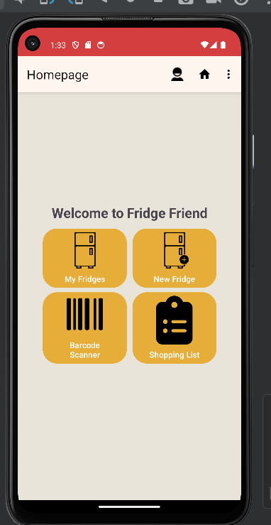
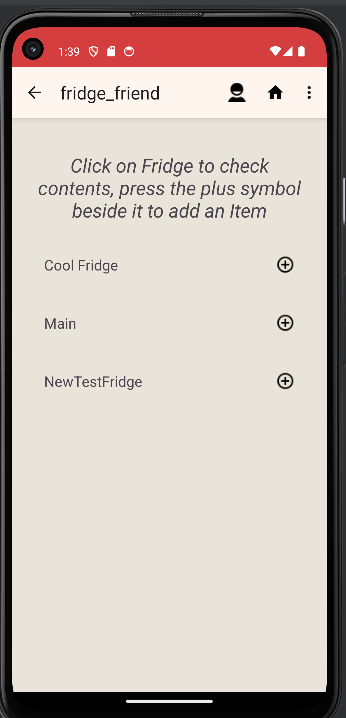
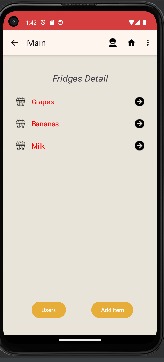
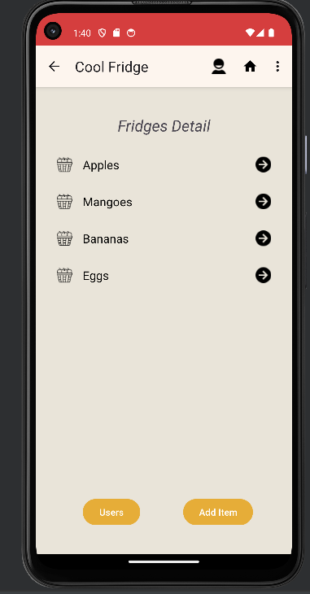

# Fridge Friend - Android App

## Overview
Fridge Friend is an Android app designed to help users manage the contents of their fridges efficiently. It's particularly useful for shared refrigerators in households, office breakrooms, or communal living spaces. The app focuses on reducing food waste, saving money on groceries, and resolving common fridge-sharing issues.

## Features
- **Account Creation and Management**: Users can sign up and manage their accounts to access all features.
- **Fridge Management**:users can Create or join a virtual representation of a physical fridge. Users can leave a fridge when it's no longer in use.
- **Item Tracking**: Users can Add items to the fridge with details like quantity, ownership, and expiration dates. Users receive notifications as the expiration dates approach.
- **Shared Fridge Functionality**: Multiple users can join the same virtual fridge, making it easier to manage shared spaces.
- **Barcode Scanner**: A handy tool for scanning food items at the supermarket, providing nutritional facts and helping users make informed purchasing decisions.

## Getting Started
1. Install the app on an Android device with a working camera.
2. Create an account and log in.
3. Explore features like adding a new fridge, scanning items, and managing fridge contents.

## Future Enhancements (Planned)
- Dietary restriction settings.
- Enhanced notifications for expired items.
- Expanded food data utilization.
- Improvements in UI and documentation.

## Note
This project is a work-in-progress and part of a course assignment. It's intended as a prototype to demonstrate the concept.

